# IW1RMM CW Encoder

**Firmware v7.1.4 — IW1RMM (Mauri)**

Morse code keyer WinKey WK3-compliant per ESP32-2432S028R (CYD), con display ILI9341 320×240 touchscreen.
Basato sul firmware originale di VK2IDL, esteso e adattato per il CYD.

---

## Hardware

### Schema elettrico

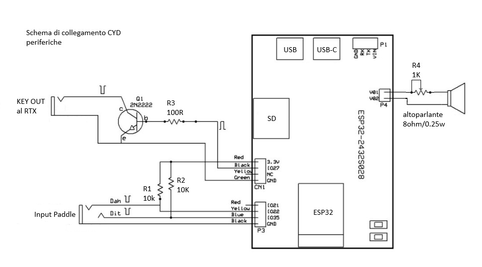

### Collegamento paddle e tasto verticale

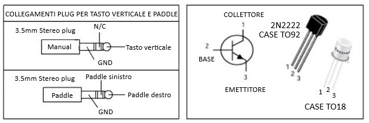

### Vista interna dei collegamenti

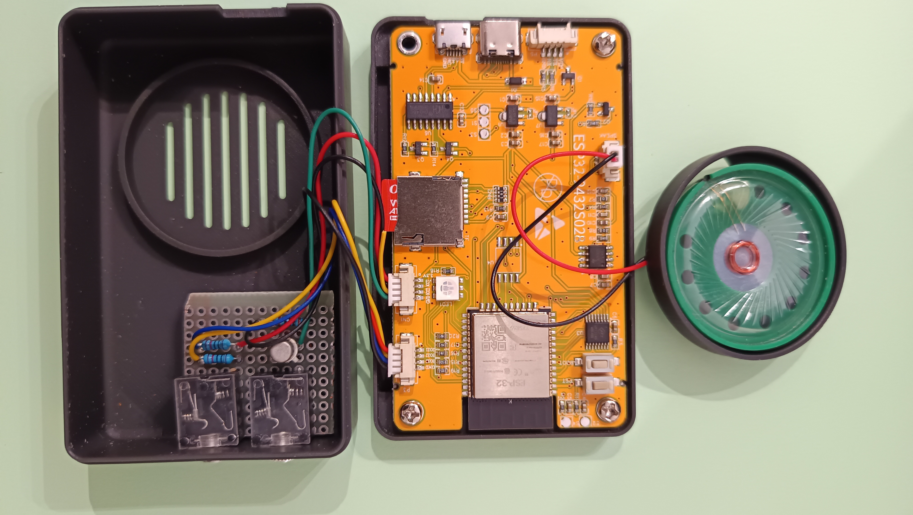

### Vista d'insieme

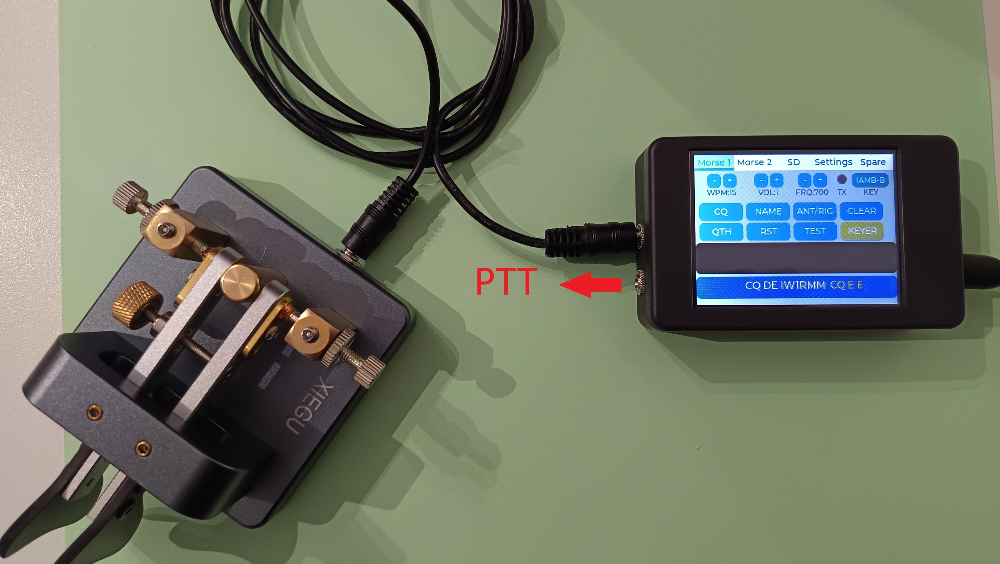

---

## Funzionalità

- WinKey WK3 via USB Serial (1200 baud)
- K3NG ASCII command set via Serial e BLE Nordic UART
- LVGL touchscreen UI (5 tab)
- Modalità keyer: Iambic A/B, Bug, Auto, Ultimatic
- SD card playback con logging CSV
- QRSS / HSCW / Beacon / Contest
- Calibrazione touch interattiva a 4 punti
- Orologio con offset GMT, supporto DS3231 RTC
- Farnsworth, Prosign, DAH ratio, Spacing weight
- Memorie K3NG A–Z (NVS)
- Messaggi preimpostati (6 slot, NVS)

---

## Interfaccia — Screenshots

### Tab Morse 1

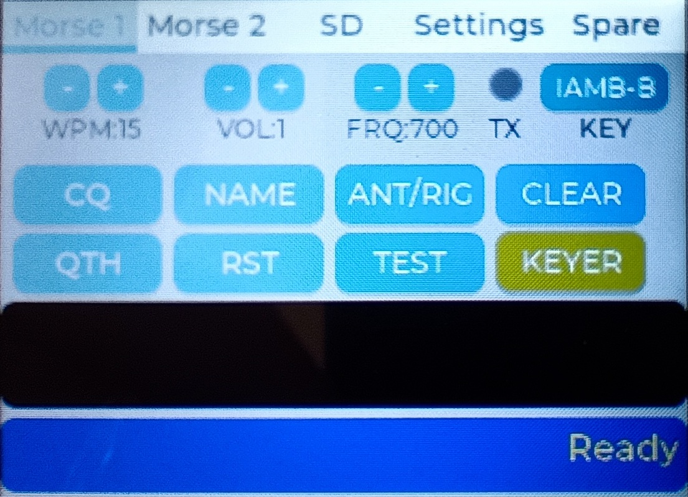

### Keyboard — long press

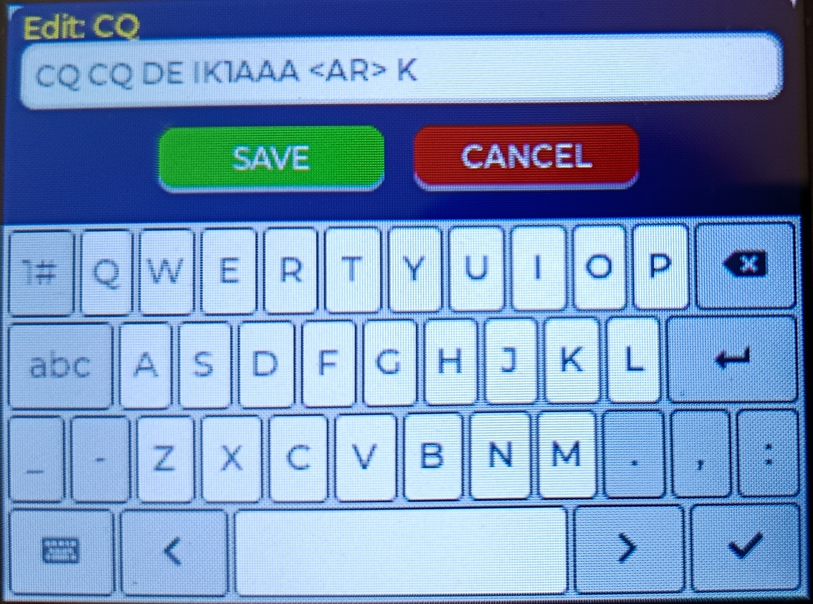

### Tab Morse 2

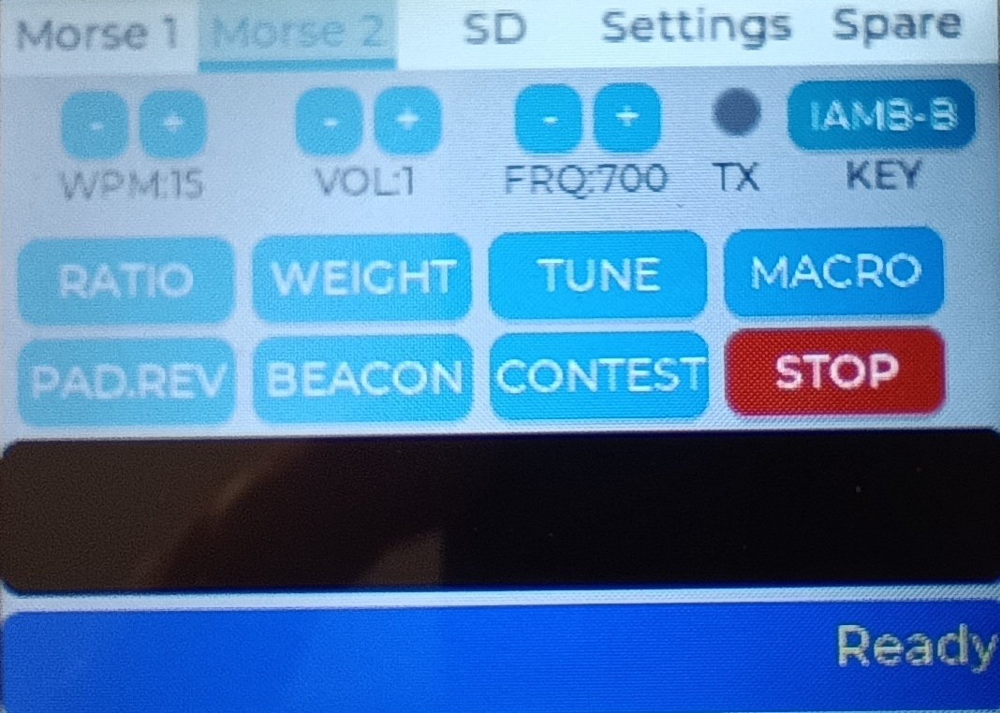

### Tab SD

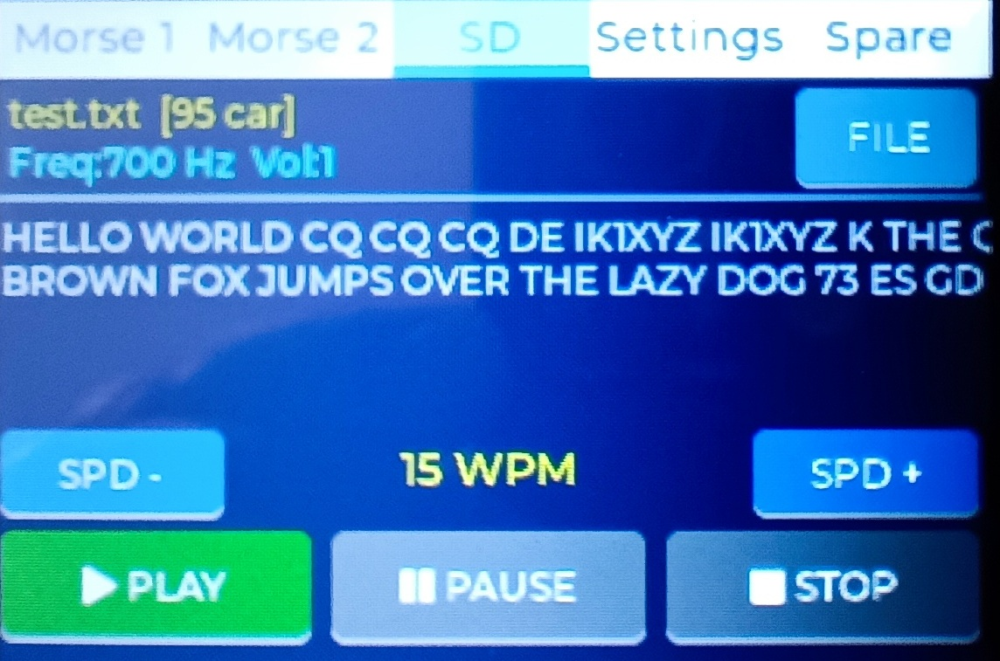

### Tab Settings — stato di default

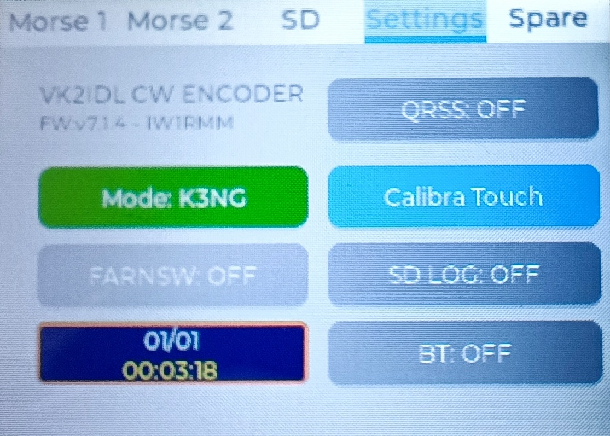

### Tab Settings — con i tasti attivi

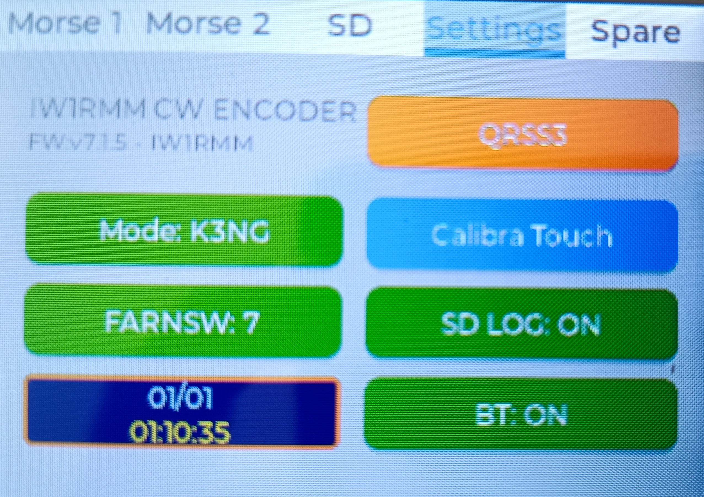

---

## BLE

Il firmware espone un servizio Nordic UART (NUS) con nome **VK2IDL_Morse**.  
Supporta lo stesso set di comandi K3NG disponibile via Serial.

### Comandi K3NG via BLE — screenshot smartphone

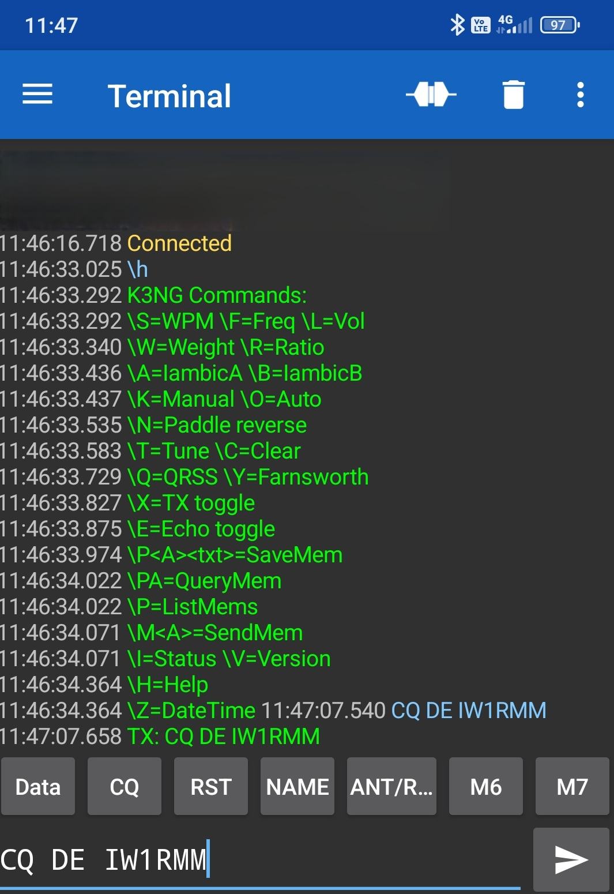

---

## Pinout ESP32-2432S028R (CYD)

| GPIO | Funzione | Note |
|------|----------|-------|
| 27 | KEY / PTT output | Uscita keyer |
| 26 | Sidetone DAC | Audio 300–1200 Hz |
| 22 | DIT input | Paddle |
| 21 | DAH input | Paddle |
| 5 | SD_CS | SPI SD card |
| 23 | SD_MOSI | SPI SD card |
| 19 | SD_MISO | SPI SD card |
| 18 | SD_SCK | SPI SD card |
| 2 | TFT_RS | Display ILI9341 |
| 15 | TFT_CS | Display ILI9341 |
| 4 | XPT2046 CS | Touch |
| 36 | XPT2046 IRQ | Touch interrupt |

---

## Dipendenze (librerie Arduino)

- LVGL ≥ 8.x
- TFT_eSPI
- XPT2046_Touchscreen
- ESP32 BLE Arduino
- ESP32 Preferences (NVS)
- SD (built-in)

---

## Installazione

1. Clona il repository
```bash
git clone https://github.com/TUO_USER/IW1RMM_CW_Encoder.git
```
2. Copia `include/lv_conf.h` nella cartella delle librerie LVGL
3. Configura `User_Setup.h` di TFT_eSPI (vedi `docs/User_Setup_example.h`)
4. Compila con Arduino IDE — board: **ESP32 Dev Module**  
   In **Tools**, imposta:
   - Flash Mode: **DIO**
   - Flash Frequency: **40MHz**
   - Partition Scheme: **Huge APP (3MB No OTA/1MB SPIFFS)**
5. Upload via Arduino IDE — il firmware è di grandi dimensioni, **l'upload richiederà alcuni minuti** (large sketch upload time is expected).

> **Nota:** I parametri Flash Mode DIO e Flash Frequency 40MHz sono necessari per compatibilità con il chip ZBIT presente in alcune unità CYD.

---

## Comandi K3NG principali

| Comando | Funzione |
|---------|----------|
| `\Snn` | Imposta velocità (WPM) |
| `\Fnnnn` | Imposta frequenza sidetone (Hz) |
| `\Ln` | Imposta livello volume (0–4) |
| `\R nnn` | DAH ratio × 100 (es. \R300 = 3.0) |
| `\W nnn` | Spacing weight × 100 (es. \W100 = 1.0) |
| `\Y nn` | Farnsworth WPM (0 = disabilita) |
| `\Q n` | QRSS (0/3/6/10/30 secondi per dit) |
| `\T` | TUNE — portante continua |
| `\J` | Reset calibrazione touch |
| `\Z DDMMAAAAHHmmSS` | Imposta orologio |
| `\G ±n` | Offset GMT |
| `\PA testo` | Salva memoria K3NG (A–Z) |
| `\MA` | Invia memoria K3NG A |
| `\P` | Lista tutte le memorie |
| `\?` | Help completo |

---

## Versione

| Versione | Data | Note |
|----------|------|------|
| v7.1.4 | 2026-03 | Touch calibration, prosign, DS3231, K3NG esteso |

---

## Crediti

- Firmware originale: **VK2IDL**
- Modifiche, estensioni e adattamento CYD: **IW1RMM (Mauri)**, 2025–2026

---

## Licenza

GPL v3 — vedi file `LICENSE`
